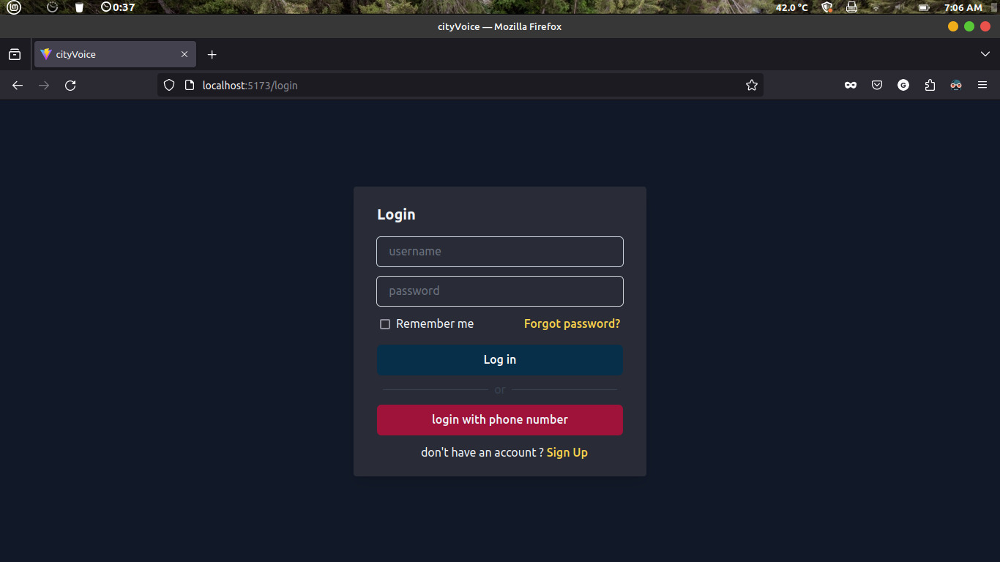
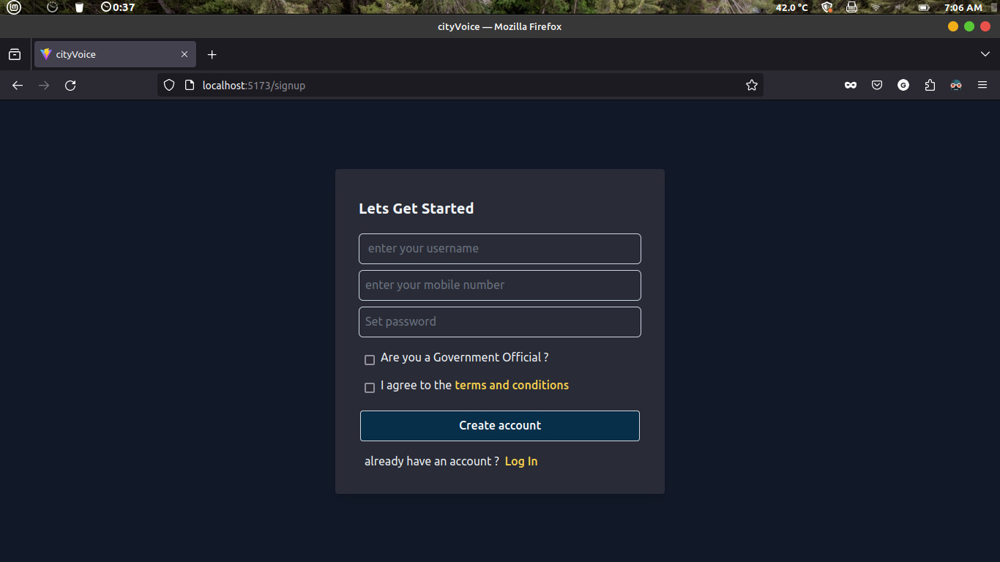
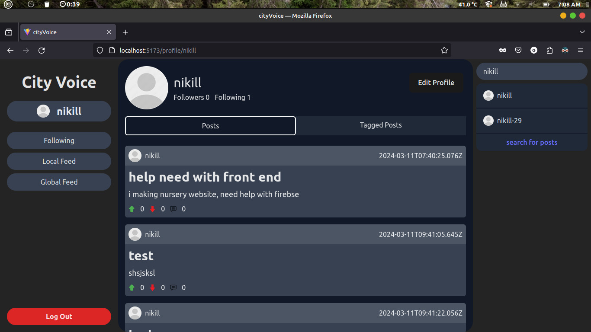
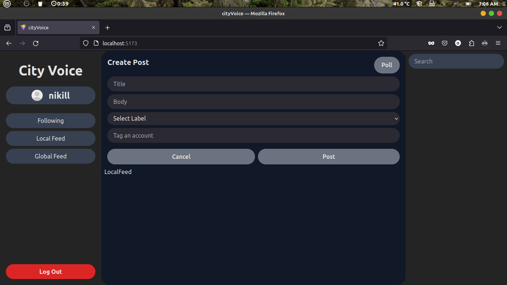
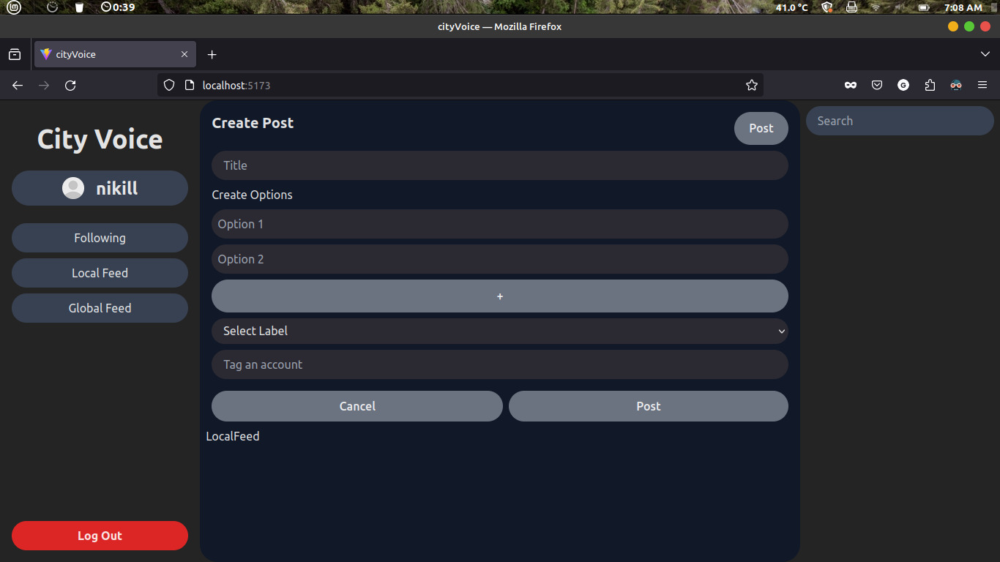

## CityVoice: A Decentralized Social Media Network for Local Communities

### Introduction

CityVoice is a decentralized social media network designed to empower local communities by providing a platform for citizens to connect, share ideas, and engage in meaningful discussions. Our platform is built on the principles of transparency, accountability, and community-driven decision-making.

### How it Works

CityVoice is a decentralized network of servers, each hosted and managed by local communities. This allows for a more democratic and participatory approach to social media, where users have control over their data and can engage with their local community in a more meaningful way.

### Why it Matters

In today's digital landscape, it's more important than ever to have a platform that prioritizes community engagement, transparency, and accountability. By using cityvoice, you'll be able to:

- Connect with your local community and engage in meaningful discussions
- Participate in democratic decision-making and shape the future of your community

### Get Involved

CityVoice is an open-source project, and we welcome contributions from developers, designers, and community organizers alike. Whether you're interested in improving our codebase, designing new features, or helping to spread the word, we'd love to have you on board.

demo screenshots

### Login
Securely access your Cityvoice account with our easy-to-use login system.

### Signup
Create an account and start engaging with your local community today!

### Profile
Showcase your personality and interests with a customizable profile page.

### Search
Find and connect with like-minded individuals, local businesses, and community leaders.

### Create post
Share your thoughts, ideas, opinions and issues with the community.

### create poll
Engage in democratic decision-making by creating and participating in polls.

### contributors

<!-- ALL-CONTRIBUTORS-LIST:START - Do not remove or modify this section -->
<!-- prettier-ignore-start -->
<!-- markdownlint-disable -->
<table>
  <tbody>
    <tr>
      <td align="center" valign="top" width="14.28%"><a href="http://github.com/aquaticcalf"> <b>aquaticcalf</b></a> <a href="https://github.com/flemingslefthandrule/cityvoicejs/commits?author=aquaticcalf" title="Frontend">➡️</a> <a href="https://github.com/flemingslefthandrule/cityvoice/commits?author=aquaticcalf" title="Documentation">📖</a> <a href="https://github.com/flemingslefthandrule/cityvoicepy/commits?author=aquaticcalf" title="Backend">⬅️</a></td>
      <td align="center" valign="top" width="14.28%"><a href="https://github.com/MGuruNikhil"> <b>MGuruNikhil</b></a> <a href="https://github.com/flemingslefthandrule/cityvoicejs/commits?author=MGuruNikhil" title="Frontend">➡️</a> <a href="https://github.com/flemingslefthandrule/cityvoicepy/commits?author=MGuruNikhil" title="Backend">⬅️</a></td>
      <td align="center" valign="top" width="14.28%"><a href="https://github.com/jagadeesh-debug"> <b>Jagadeesh</b></a> <a href="https://github.com/flemingslefthandrule/cityvoicejs/commits?author=jagadeesh-debug" title="Frontend">➡️</a></td>
      <td align="center" valign="top" width="14.28%"><a href="https://github.com/Nischa1Mv"> <b>Nischal_UwU</b></a> <a href="https://github.com/flemingslefthandrule/cityvoicejs/commits/!mine?author=Nischa1Mv" title="Frontend">➡️</a></td>
    </tr>
  </tbody>
</table>

<!-- markdownlint-restore -->
<!-- prettier-ignore-end -->

<!-- ALL-CONTRIBUTORS-LIST:END -->

### License

CityVoice is licensed under the [MIT License](license.md).