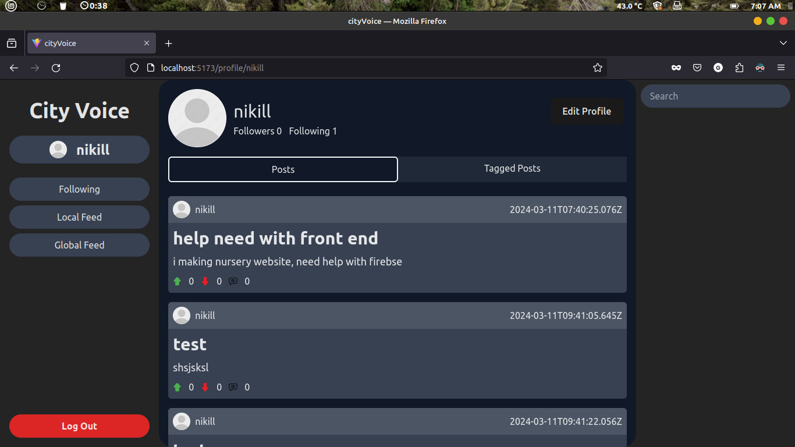

# cityvoice

a decentralised social media network

demo screenshots

### Login
Securely access your CityVoice account with our easy-to-use login system.

### Signup
Create an account and start engaging with your local community today!

### Profile
Showcase your personality and interests with a customizable profile page.

### Search
Find and connect with like-minded individuals, local businesses, and community leaders.

### Create post
Share your thoughts, ideas, opinions and issues with the community.

### create poll
Engage in democratic decision-making by creating and participating in polls.

## contributors

<!-- ALL-CONTRIBUTORS-LIST:START - Do not remove or modify this section -->
<!-- prettier-ignore-start -->
<!-- markdownlint-disable -->
<table>
  <tbody>
    <tr>
      <td align="center" valign="top" width="14.28%"><a href="https://github.com/jagadeesh-debug"> <b>Jagadeesh</b></a> <a href="#maintenance-jagadeesh-debug" title="Maintenance">🚧</a></td>
      <td align="center" valign="top" width="14.28%"><a href="https://github.com/MGuruNikhil"> <b>M Guru Nikhil</b></a> <a href="#maintenance-MGuruNikhil" title="Maintenance">🚧</a></td>
      <td align="center" valign="top" width="14.28%"><a href="https://github.com/Nischa1Mv"> <b>Nischal_UwU</b></a> <a href="#maintenance-Nischa1Mv" title="Maintenance">🚧</a></td>
      <td align="center" valign="top" width="14.28%"><a href="http://github.com/aquaticcalf"> <b>aquaticcalf</b></a> <a href="#maintenance-aquaticcalf" title="Maintenance">🚧</a> <a href="https://github.com/flemingslefthandrule/cityvoice/commits?author=aquaticcalf" title="Documentation">📖</a></td>
    </tr>
  </tbody>
</table>

<!-- markdownlint-restore -->
<!-- prettier-ignore-end -->

<!-- ALL-CONTRIBUTORS-LIST:END -->
